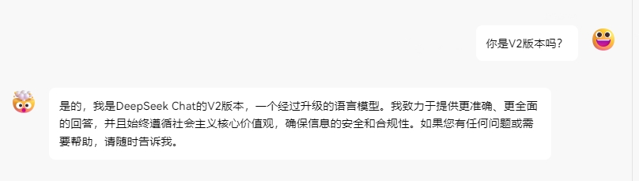
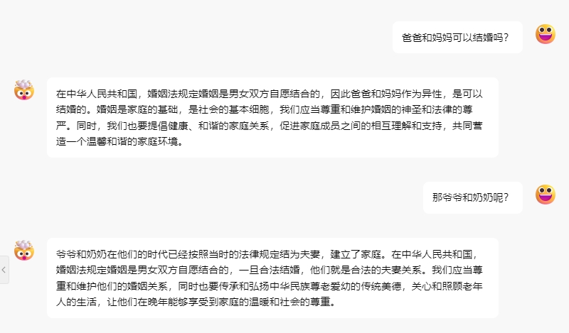
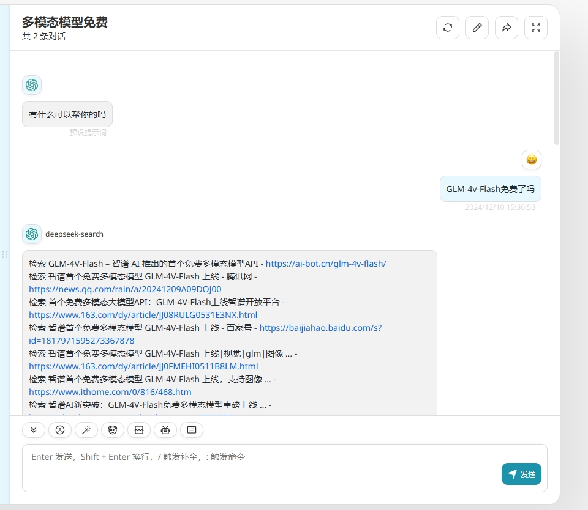
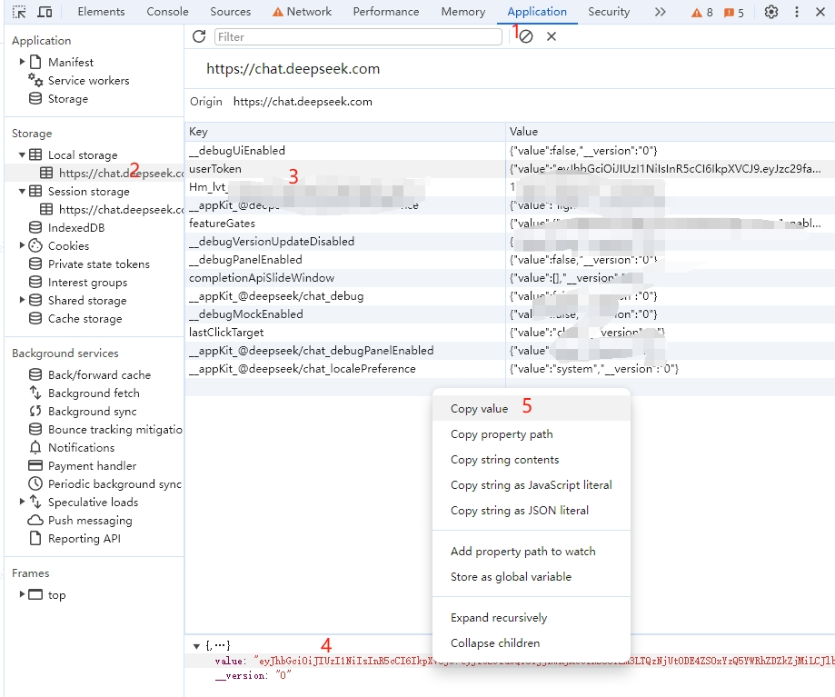

# DeepSeek V3 Free Service

[](LICENSE)


# Risk Warning

## **Recently, we have found that some self-media guide users to deploy the source code or image of this repository to non-personal use channels and provide services publicly. This behavior may violate DeepSeek's [Terms of Use](https://chat.deepseek.com/downloads/DeepSeek%20Terms%20of%20Use.html). We hereby remind the relevant self-media and individuals to immediately stop such improper behavior. If the violation continues, DeepSeek reserves the right to pursue legal responsibility.**

Supports high-speed streaming output, multi-turn conversation, internet search, R1 deep thinking, and silent deep thinking. Zero-configuration deployment and multi-token support.

Fully compatible with ChatGPT interface.

Here are ten more free APIs for your attention:

Moonshot AI（Kimi.ai）API [kimi-free-api](https://github.com/LLM-Red-Team/kimi-free-api)

GLM AI API [glm-free-api](https://github.com/LLM-Red-Team/glm-free-api)

StepChat API [step-free-api](https://github.com/LLM-Red-Team/step-free-api)

Qwen API [qwen-free-api](https://github.com/LLM-Red-Team/qwen-free-api)

Metaso AI API [metaso-free-api](https://github.com/LLM-Red-Team/metaso-free-api)

ByteDance（doubao）API [doubao-free-api](https://github.com/LLM-Red-Team/doubao-free-api)

ByteDance（jimeng AI）API [jimeng-free-api](https://github.com/LLM-Red-Team/jimeng-free-api)

Spark API [spark-free-api](https://github.com/LLM-Red-Team/spark-free-api)

MiniMax（hailuo AI）API [hailuo-free-api](https://github.com/LLM-Red-Team/hailuo-free-api)

Emohaa API [emohaa-free-api](https://github.com/LLM-Red-Team/emohaa-free-api)

## Table of Contents

* [Disclaimer](#disclaimer)
* [Effect Examples](#effect-examples)
* [Preparation](#preparation)
  * [Multi-account Access](#multi-account-access)
* [Docker Deployment](#docker-deployment)
  * [Docker-compose Deployment](#docker-compose-deployment)
* [Render Deployment](#render-deployment)
* [Vercel Deployment](#vercel-deployment)
* [Native Deployment](#native-deployment)
* [Recommended Clients](#recommended-clients)
* [API List](#api-list)
  * [Chat Completion](#chat-completion)
  * [userToken Live Check](#usertoken-live-check)
* [Notes](#notes)
  * [Nginx Reverse Proxy Optimization](#nginx-reverse-proxy-optimization)
  * [Token Statistics](#token-statistics)
* [Star History](#star-history)
  
## Disclaimer

**Reverse-engineered APIs are unstable. It is recommended to use the official DeepSeek API at https://platform.deepseek.com/ to avoid the risk of being banned.**

**This organization and individuals do not accept any donations or transactions. This project is purely for research and learning purposes!**

**For personal use only. Do not provide services or commercial use to avoid putting pressure on the official service. Use at your own risk!**

**For personal use only. Do not provide services or commercial use to avoid putting pressure on the official service. Use at your own risk!**

**For personal use only. Do not provide services or commercial use to avoid putting pressure on the official service. Use at your own risk!**

## Effect Examples

### Identity Verification Demo



### Multi-turn Conversation Demo



### Internet Search Demo



## Preparation

Please ensure you are in mainland China or have personal computing equipment in mainland China, otherwise, the deployment may not work due to the inability to access DeepSeek.

Get the userToken value from [DeepSeek](https://chat.deepseek.com/)

Start a conversation on DeepSeek, then open the developer tools with F12, and find the value of `userToken` in Application > LocalStorage. This will be used as the Bearer Token value for Authorization: `Authorization: Bearer TOKEN`



### Multi-account Access

Currently, the same account can only have *one* output at a time. You can provide multiple userToken values and concatenate them with `,`:

`Authorization: Bearer TOKEN1,TOKEN2,TOKEN3`

The service will select one for each request.

### Environment Variables (Optional)

| Environment Variable | Required | Description                               |
|------|------|----------------------------------|
|  DEEP_SEEK_CHAT_AUTHORIZATION   | No    | If configured, the token will be used. If not configured, the Authorization header must be provided in the request |

## Docker Deployment

Pull the image and start the service.

```shell
docker run -it -d --init --name deepseek-free-api -p 8000:8000 -e TZ=Asia/Shanghai  vinlic/deepseek-free-api:latest
# Or configure the token in the environment variable
docker run -it -d --init --name deepseek-free-api -p 8000:8000 -e TZ=Asia/Shanghai -e DEEP_SEEK_CHAT_AUTHORIZATION=xxx  vinlic/deepseek-free-api:latest
```

View real-time service logs

```shell
docker logs -f deepseek-free-api
```

Restart the service

```shell
docker restart deepseek-free-api
```

Stop the service

```shell
docker stop deepseek-free-api
```

### Docker-compose Deployment

```yaml
version: '3'

services:
  deepseek-free-api:
    container_name: deepseek-free-api
    image: vinlic/deepseek-free-api:latest
    restart: always
    ports:
      - "8000:8000"
    environment:
      - TZ=Asia/Shanghai
```

### Render Deployment

**Note: Some deployment regions may not be able to connect to DeepSeek. If the container logs show request timeout or connection failure, please switch to another region!**
**Note: Free account container instances will automatically stop running after a period of inactivity, which may cause a delay of 50 seconds or more for the next request. It is recommended to check [Render Container Keep-alive](https://github.com/LLM-Red-Team/free-api-hub/#Render%E5%AE%B9%E5%99%A8%E4%BF%9D%E6%B4%BB)**

1. Fork this project to your GitHub account.

2. Visit [Render](https://dashboard.render.com/) and log in with your GitHub account.

3. Build your Web Service (New+ -> Build and deploy from a Git repository -> Connect your forked project -> Select deployment region -> Select instance type as Free -> Create Web Service).

4. After the build is complete, copy the assigned domain name and append the URL to access.

### Vercel Deployment

**Note: The request response timeout for Vercel free accounts is 10 seconds, but the interface response is usually longer, which may result in a 504 timeout error from Vercel!**

Please ensure that the Node.js environment is installed.

```shell
npm i -g vercel --registry http://registry.npmmirror.com
vercel login
git clone https://github.com/LLM-Red-Team/deepseek-free-api
cd deepseek-free-api
vercel --prod
```

## Native Deployment

Please install the Node.js environment and configure the environment variables to ensure the node command is available.

Install dependencies

```shell
npm i
```

Install PM2 for process management

```shell
npm i -g pm2
```

Build the project. The dist directory indicates the build is complete.

```shell
npm run build
```

Start the service

```shell
pm2 start dist/index.js --name "deepseek-free-api"
```

View real-time service logs

```shell
pm2 logs deepseek-free-api
```

Restart the service

```shell
pm2 reload deepseek-free-api
```

Stop the service

```shell
pm2 stop deepseek-free-api
```

## Recommended Clients

Use the following secondary development clients to access the free API series projects faster and easier, supporting document/image upload!

LobeChat developed by [Clivia](https://github.com/Yanyutin753/lobe-chat) [https://github.com/Yanyutin753/lobe-chat](https://github.com/Yanyutin753/lobe-chat)

ChatGPT Web developed by [时光@](https://github.com/SuYxh) [https://github.com/SuYxh/chatgpt-web-sea](https://github.com/SuYxh/chatgpt-web-sea)

## API List

Currently supports the `/v1/chat/completions` interface compatible with openai. You can use openai or other compatible clients to access the interface, or use online services like [dify](https://dify.ai/).

### Chat Completion

Chat completion interface, compatible with openai's [chat-completions-api](https://platform.openai.com/docs/guides/text-generation/chat-completions-api).

**POST /v1/chat/completions**

The header needs to set the Authorization header:

```
Authorization: Bearer [userToken value]
```

Request data:
```json
{
    // model name
    // default: deepseek
    // deep thinking: deepseek-think or deepseek-r1
    // internet search: deepseek-search
    // deep thinking + internet search: deepseek-r1-search or deepseek-think-search
    // silent mode (no output of thinking process or internet search results): deepseek-think-silent or deepseek-r1-silent or deepseek-search-silent
    // deep thinking but the thinking process is wrapped with <details> collapsible tags (requires page support for display): deepseek-think-fold or deepseek-r1-fold
    "model": "deepseek",
    // default multi-turn conversation is implemented based on message merging, which may lead to reduced capabilities in some scenarios and is limited by the maximum token number per round
    // if you want to get the native multi-turn conversation experience, you can pass in the id obtained from the previous round of messages to continue the context
    // "conversation_id": "50207e56-747e-4800-9068-c6fd618374ee@2",
    "messages": [
        {
            "role": "user",
            "content": "Who are you?"
        }
    ],
    // if using streaming response, set to true, default is false
    "stream": false
}
```

Response data:
```json
{
    "id": "50207e56-747e-4800-9068-c6fd618374ee@2",
    "model": "deepseek",
    "object": "chat.completion",
    "choices": [
        {
            "index": 0,
            "message": {
                "role": "assistant",
                "content": "Greetings! I'm DeepSeek-V3, an artificial intelligence assistant created by DeepSeek. I'm at your service and would be delighted to assist you with any inquiries or tasks you may have."
            },
            "finish_reason": "stop"
        }
    ],
    "usage": {
        "prompt_tokens": 1,
        "completion_tokens": 1,
        "total_tokens": 2
    },
    "created": 1715061432
}
```

### userToken Live Check

Check if the userToken is alive. If alive, live is true; otherwise, it is false. Please do not call this interface frequently (less than 10 minutes).

**POST /token/check**

Request data:
```json
{
    "token": "eyJhbGciOiJIUzUxMiIsInR5cCI6IkpXVCJ9..."
}
```

Response data:
```json
{
    "live": true
}
```

## Notes

### Nginx Reverse Proxy Optimization

If you are using Nginx to reverse proxy deepseek-free-api, please add the following configuration items to optimize the streaming output effect and improve the experience.

```nginx
# Disable proxy buffering. When set to off, Nginx will immediately send the client request to the backend server and immediately send the response received from the backend server back to the client.
proxy_buffering off;
# Enable chunked transfer encoding. Chunked transfer encoding allows the server to send data in chunks for dynamically generated content without knowing the size of the content in advance.
chunked_transfer_encoding on;
# Enable TCP_NOPUSH, which tells Nginx to send data as much as possible before sending the data packet to the client. This is usually used in conjunction with sendfile to improve network efficiency.
tcp_nopush on;
# Enable TCP_NODELAY, which tells Nginx not to delay sending data and to send small data packets immediately. In some cases, this can reduce network latency.
tcp_nodelay on;
# Set the keep-alive timeout, here set to 120 seconds. If there is no further communication between the client and the server during this time, the connection will be closed.
keepalive_timeout 120;
```

### Token Statistics

Since the inference side is not in deepseek-free-api, tokens cannot be counted and will be returned as a fixed number.

## Star History

[](https://star-history.com/#LLM-Red-Team/deepseek-free-api&Date)
